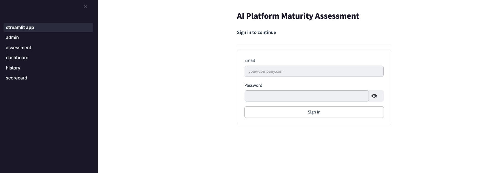
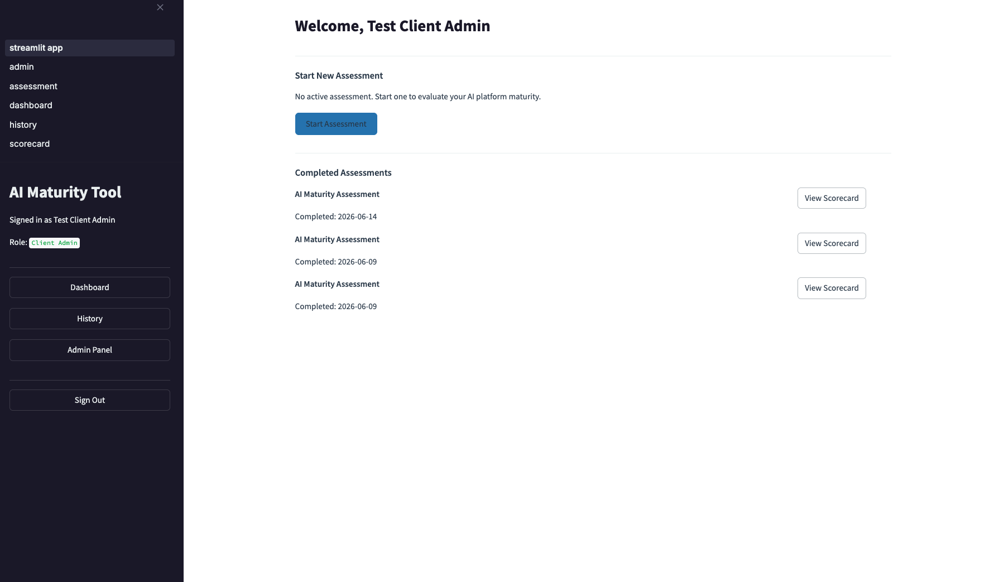
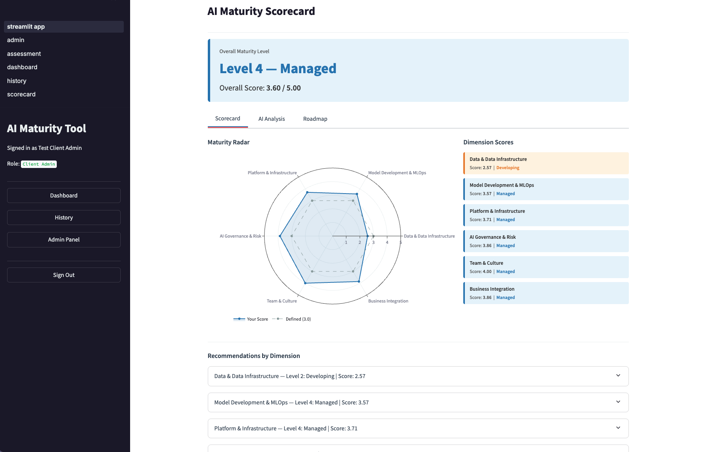
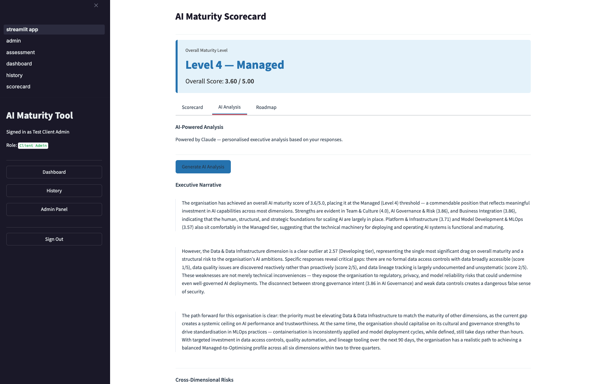
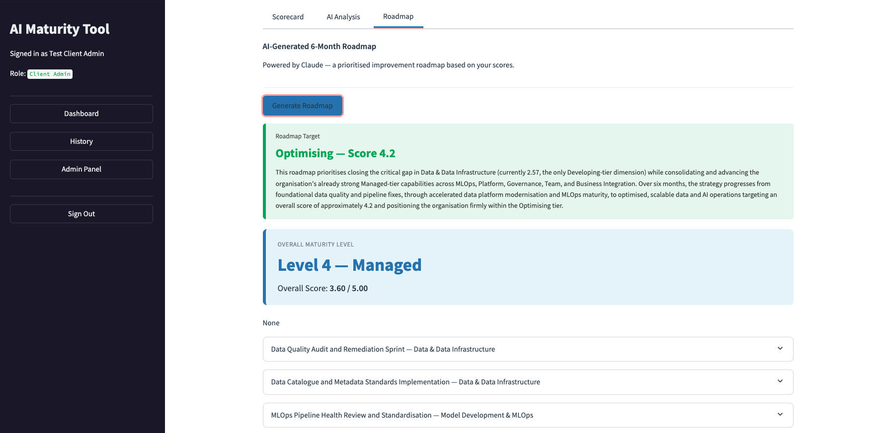

# AI Platform Maturity Assessment Tool

A full-stack AI-powered platform for assessing, scoring, and improving organisational AI maturity. Built with FastAPI, Streamlit, PostgreSQL, and Claude AI.

     

---

## Overview

This tool enables engineering leaders to assess the maturity of their AI platform and teams across six dimensions, generate AI-powered analysis, and build a prioritised improvement roadmap — all in one platform.

### Key Features

- **42-question assessment** across 6 AI maturity dimensions based on Google MLOps and Gartner frameworks
- **Automated scoring** with 5 maturity tiers (Ad Hoc → Optimizing)
- **Interactive scorecard** with radar chart visualisation
- **AI-powered executive analysis** using Claude API — narrative, risks, quick wins
- **AI-generated 6-month roadmap** with phased initiatives, effort/impact ratings
- **PDF report generation** for client delivery
- **Historical comparison** with trend charts across assessments
- **Multi-tenant architecture** with role-based access control (4 personas)
- **Admin panel** for organisation and user management

---
## Screenshots

### Login


### Dashboard


### Scorecard & Radar Chart


### AI-Powered Analysis


### 6-Month Roadmap



## Maturity Framework

| Dimension | What it measures |
|-----------|-----------------|
| Data & Data Infrastructure | Data quality, pipelines, governance, lineage |
| Model Development & MLOps | Experimentation, versioning, CI/CD for ML |
| Platform & Infrastructure | Cloud, compute, orchestration, observability |
| AI Governance & Risk | Bias, explainability, compliance, model cards |
| Team & Culture | Skills, org structure, AI literacy, leadership |
| Business Integration | ROI tracking, productionised models, feedback loops |

### Maturity Tiers

| Level | Label | Score Range |
|-------|-------|-------------|
| 1 | Ad Hoc | 1.0 – 1.79 |
| 2 | Developing | 1.80 – 2.59 |
| 3 | Defined | 2.60 – 3.39 |
| 4 | Managed | 3.40 – 4.19 |
| 5 | Optimizing | 4.20 – 5.00 |

---

## Architecture

```
┌─────────────────────────────────────────────────────┐
│                  Streamlit Frontend                 │
│     Auth · Assessment · Scorecard · Admin           │
└────────────────┬────────────────────────────────────┘
                 │ HTTP/REST
┌────────────────▼────────────────────────────────────┐
│              FastAPI Backend                        │
│   Auth · RBAC · Scoring · Claude API Integration   │
└────────────────┬────────────────────────────────────┘
                 │ SQLAlchemy ORM
┌────────────────▼────────────────────────────────────┐
│           PostgreSQL Database                       │
│   Users · Orgs · Assessments · Responses · Results │
└─────────────────────────────────────────────────────┘
```

### Tech Stack

| Layer | Technology |
|-------|-----------|
| Frontend | Streamlit 1.35 |
| Backend API | FastAPI 0.111 + Uvicorn |
| Database | PostgreSQL 16 + SQLAlchemy + Alembic |
| AI | Anthropic Claude API (claude-sonnet-4-6) |
| PDF Generation | ReportLab |
| Charts | Plotly |
| Auth | JWT (python-jose) + bcrypt |
| Container | Docker + Docker Compose |

---

## Personas & Access Control

| Role | Access |
|------|--------|
| **Super Admin** | All orgs, all assessments, platform stats, user management |
| **Client Admin** | Their org only, manage users, view all org assessments |
| **Assessor** | Run assessments, view own results |
| **Viewer** | Read-only access to results |

---

## Project Structure

```
project-a/
├── app/
│   ├── api/routes/          # FastAPI route handlers
│   │   ├── auth.py          # Login, JWT, /me
│   │   ├── assessment.py    # Assessment CRUD + AI analysis + roadmap
│   │   ├── organisations.py # Org + user management
│   │   └── admin.py         # Admin panel endpoints
│   ├── auth/
│   │   ├── login.py         # Password hashing, JWT creation
│   │   └── rbac.py          # Role-based access control dependencies
│   ├── components/
│   │   ├── question_engine.py   # YAML question bank loader + validator
│   │   ├── scoring.py           # Weighted scoring engine
│   │   ├── recommendations.py   # Tier-based static recommendations
│   │   └── report.py            # PDF report generation (ReportLab)
│   ├── config/
│   │   ├── questions.yaml   # 42 questions across 6 dimensions
│   │   └── settings.py      # Pydantic settings (env-driven)
│   ├── db/
│   │   ├── models.py        # SQLAlchemy ORM models
│   │   ├── connection.py    # DB engine + session factory
│   │   ├── seed.py          # Super admin seed script
│   │   └── migrations/      # Alembic migration versions
│   ├── main.py              # FastAPI app entry point
│   ├── streamlit_app.py     # Streamlit multi-page app
│   └── styles.py            # Global CSS styles
├── Dockerfile.fastapi
├── Dockerfile.streamlit
├── docker-compose.yml
├── requirements.fastapi.txt
├── requirements.streamlit.txt
├── alembic.ini
└── .env.example
```

---

## Local Development Setup

### Prerequisites

- Docker Desktop 20+
- Docker Compose v2+
- Anthropic API key ([console.anthropic.com](https://console.anthropic.com))

### 1. Clone the repository

```bash
git clone https://github.com/sshu24/ai-maturity-platform.git
cd ai-maturity-platform/project-a
```

### 2. Configure environment

```bash
cp .env.example .env
```

Edit `.env` and set:

```env
POSTGRES_PASSWORD=your-secure-password
SECRET_KEY=your-32-char-hex-key    # generate: openssl rand -hex 32
ANTHROPIC_API_KEY=your-claude-api-key
```

### 3. Start the platform

```bash
docker compose up --build -d
```

### 4. Run database migrations

```bash
docker compose run --rm fastapi alembic upgrade head
```

### 5. Seed the super admin

```bash
docker compose run --rm fastapi python -m app.db.seed
```

### 6. Open the app

| Service | URL |
|---------|-----|
| Streamlit UI | http://localhost:8501 |
| FastAPI docs | http://localhost:8000/docs |

**Default credentials:**
- Email: `admin@projecta.com`
- Password: `changeme123!`

> Change the password immediately after first login.

---

## First Run Walkthrough

1. **Sign in** as super admin
2. **Create an organisation** via Admin Panel → Organisations → + New Organisation
3. **Create a client admin** user in that org via Admin Panel → Users → + New User
4. **Sign in** as the client admin
5. **Start an assessment** from the Dashboard
6. **Answer all 42 questions** across 6 dimensions — progress is saved automatically
7. **Submit** to generate the scorecard
8. **View the scorecard** — radar chart, dimension scores, recommendations
9. **Generate AI Analysis** (Claude) — executive narrative, risks, quick wins
10. **Generate Roadmap** (Claude) — 6-month phased improvement plan
11. **Download PDF** report for client delivery
12. **Track progress** via History page after completing multiple assessments

---

## AI-Powered Features

### Assessment Interpreter Agent
Uses Claude to analyse all 42 responses and generate:
- 3-paragraph executive narrative referencing actual scores
- Cross-dimensional risk identification
- Quick wins (high impact, low effort)
- 90-day focus areas with success metrics

### Roadmap Generator Agent
Uses Claude to generate a phased 6-month improvement roadmap:
- 3 phases: Foundation → Acceleration → Optimisation
- 3-4 initiatives per phase with owner, effort, impact ratings
- Dependencies between initiatives
- Target dimension scores at end of each phase

---

## API Reference

| Method | Endpoint | Description |
|--------|----------|-------------|
| POST | `/auth/login` | Authenticate, get JWT token |
| GET | `/auth/me` | Current user details |
| POST | `/assessments` | Create new assessment |
| GET | `/assessments/active` | Get in-progress assessment |
| POST | `/assessments/{id}/responses` | Save a response (upsert) |
| POST | `/assessments/{id}/submit` | Submit and score |
| GET | `/assessments/{id}/result` | Get scorecard result |
| POST | `/assessments/{id}/analyse` | Generate AI analysis |
| POST | `/assessments/{id}/roadmap` | Generate 6-month roadmap |
| GET | `/assessments/history/all` | Historical results |
| GET | `/admin/stats` | Platform statistics |
| GET | `/admin/organisations` | All organisations |
| POST | `/admin/users` | Create user |

Full interactive docs at `http://localhost:8000/docs`

---

## Roadmap

- [ ] AWS deployment (ECS Fargate + RDS)
- [ ] Technical Probe Agent (auto-assess datasource connectivity)
- [ ] Email notifications for assessment completion
- [ ] Comparative benchmarking against industry averages
- [ ] SSO / OAuth integration
- [ ] Assessment templates per industry vertical

---

## Author

Built by Shubha Sundar — Senior Engineering leader with hands-on AI platform experience.

[GitHub](https://github.com/sshu24) · [LinkedIn](https://www.linkedin.com/in/candidleader)

---

## License

MIT