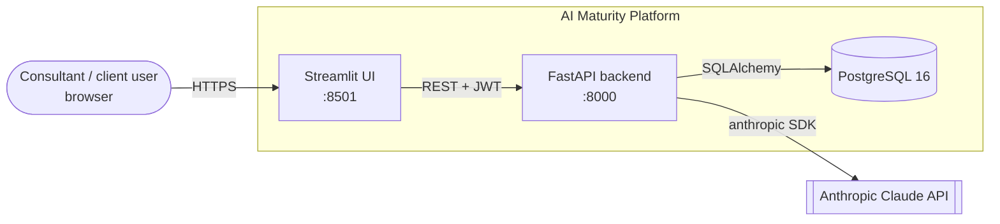
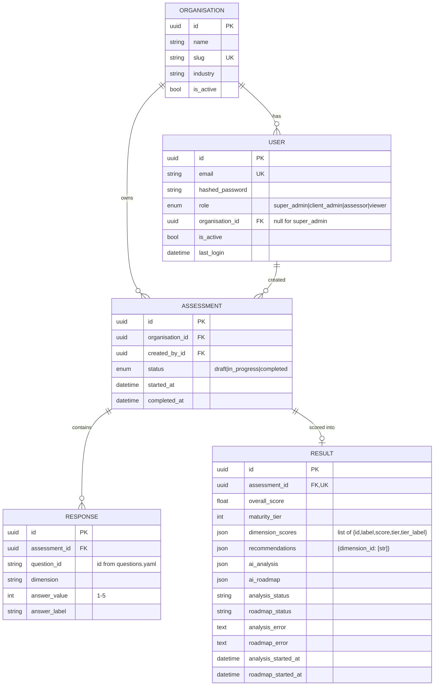
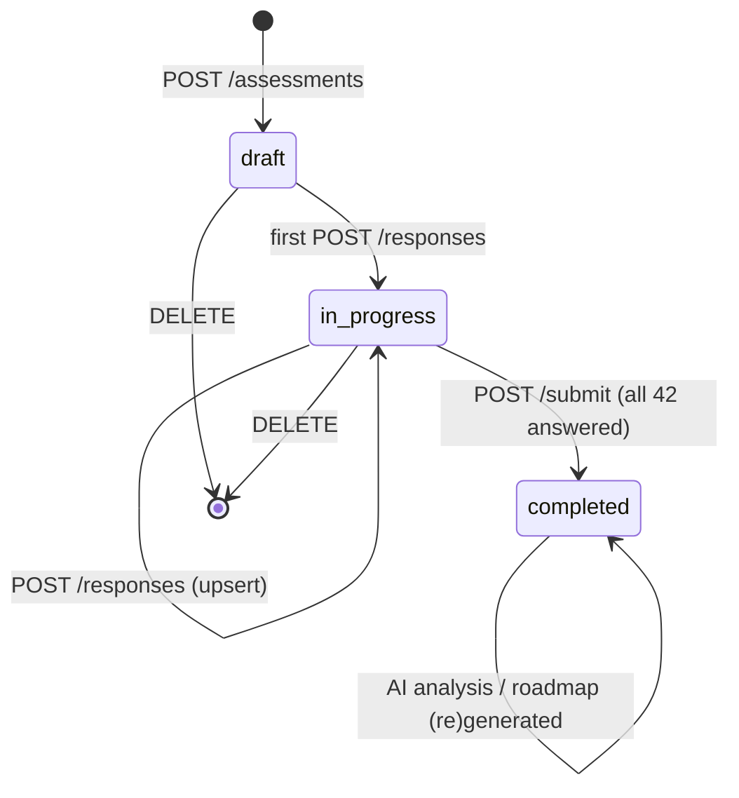
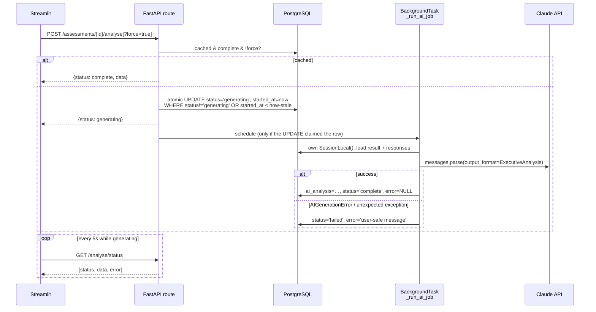
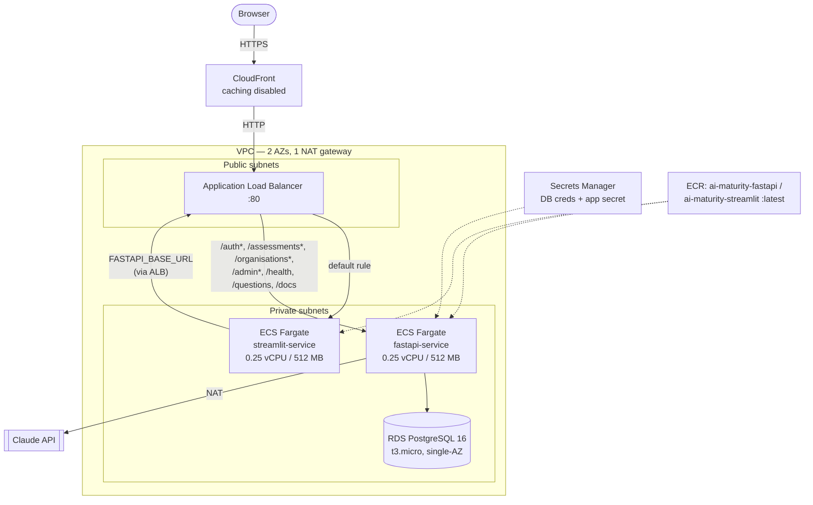

# Architecture

This document describes how the AI Maturity Platform is built and why. For endpoint-level detail, see [API.md](API.md). For setup, see the [README](../README.md).

## 1. What the system does

An organisation answers 42 questions across 6 AI-maturity dimensions. The platform scores the answers, places the organisation in one of 5 maturity tiers, and gives static recommendations for each dimension. It then uses Claude to write an executive analysis and a phased 6-month roadmap. Results can be downloaded as a PDF and compared over time.

**Quality goals, in priority order:**
1. **Tenant isolation.** One organisation must never see another's data.
2. **Deterministic, explainable scoring.** The same answers always give the same score, and the logic can be read in one file.
3. **Resilient AI features.** Claude calls are slow and can fail. The app must stay responsive and explain the failure.
4. **Simplicity.** One team should be able to run it without extra platform pieces (no queue, cache or separate auth service).

## 2. System context



The browser only ever talks to Streamlit. Streamlit is a **server-side** client of the API: it holds the user's JWT in `st.session_state` and calls FastAPI with `requests`. The API is also reachable directly, through `/docs` locally or through the ALB in AWS.

## 3. Containers and code layout

The repository holds one Python package, `app/`, which is built into **two images** with separate dependency sets:

| Image | Entry point | Dependencies | Responsibilities |
|-------|-------------|--------------|------------------|
| `Dockerfile.fastapi` | `uvicorn app.main:app` | `requirements.fastapi.txt` (FastAPI, SQLAlchemy, Alembic, `anthropic`, jose/passlib) | Auth, RBAC, persistence, scoring, AI jobs |
| `Dockerfile.streamlit` | `streamlit run app/streamlit_app.py` | `requirements.streamlit.txt` (Streamlit, Plotly, ReportLab) | UI, charts, PDF rendering |

The Streamlit image doesn't have the database or SQLAlchemy dependencies. UI code may import pure helpers such as `app/components/report.py`, but never `app/db` or `app/api`.

```
app/
├── main.py                  FastAPI app, CORS, router wiring, /health, /questions
├── api/routes/              HTTP layer, one router per area
│   ├── auth.py              /auth: login, me
│   ├── assessment.py        /assessments: lifecycle, scoring trigger, AI job orchestration
│   ├── organisations.py     /organisations
│   └── admin.py             /admin: admin panel endpoints
├── auth/
│   ├── login.py             bcrypt hashing, JWT creation
│   └── rbac.py              get_current_user, require_role(...) dependencies
├── components/              Domain logic, no HTTP or DB code
│   ├── question_engine.py   Loads and validates questions.yaml
│   ├── scoring.py           Weighted scoring, tier mapping
│   ├── recommendations.py   Static recommendations per dimension and tier
│   ├── ai_agents.py         Claude prompts, output schemas, error mapping
│   └── report.py            PDF generation (used by Streamlit)
├── config/
│   ├── questions.yaml       The question bank (content, not code)
│   └── settings.py          Pydantic settings from env / .env
├── db/
│   ├── models.py            SQLAlchemy models
│   ├── connection.py        Engine, SessionLocal, get_db dependency
│   ├── seed.py              Creates the first super admin
│   └── migrations/          Alembic
├── streamlit_app.py         The whole UI (pages are functions; routing via session_state)
└── styles.py                Shared CSS and UI widgets
infra/                       AWS CDK (TypeScript)
tests/                       pytest suite (SQLite, Claude stubbed)
```

**Layering rule:** `api/routes` → `components` and `db`. `components` doesn't import FastAPI. `ai_agents` takes plain objects with attributes, not sessions, which makes it easy to test with stubs.

## 4. Data model



**Design notes**
- **Questions live in YAML, not the database.** Responses refer to questions by `question_id`. Question text can be edited without a migration. Renaming or removing a question ID would orphan old responses, so treat IDs as permanent.
- **`Result` is a snapshot.** Scores and recommendations are computed once, at submit time, and stored as JSON. If the scoring code or recommendations change later, old results stay as they were, which is what you want for historical comparison.
- **AI output is stored on `Result`,** together with the job's status, error and start time. The columns follow a `{kind}` naming pattern (`analysis` / `roadmap`), and `assessment.py` relies on that pattern through `getattr`. If you add a third AI artefact, follow the same naming.
- **The schema is managed by Alembic** (`app/db/migrations`). `env.py` takes the database URL from `Settings`, not from `alembic.ini`.

## 5. Key flows

### 5.1 Authentication and authorisation

1. `POST /auth/login` (form-encoded) checks the bcrypt hash and returns a JWT: `{sub: user_id, role, org_id, exp}`.
2. On each request, `rbac.get_current_user` decodes the token and **loads the user from the database** (it must be active). Role and org therefore come from the database, not from the token's claims.
3. `require_role(*roles)` is a dependency factory that controls access by role.
4. **The org check is written into each handler.** Endpoints that take an ID compare `organisation_id` with the caller's org, unless the caller is a super admin. In `assessment.py` this is centralised in `_get_assessment_or_404`. Every new endpoint must do the same check; the tests in `tests/test_api.py` cover the existing ones.

### 5.2 Assessment lifecycle



An organisation can have only one open (`draft` or `in_progress`) assessment at a time. Because answers are saved one at a time with upserts, progress survives closing the browser.

### 5.3 Scoring

`compute_scorecard` in `components/scoring.py` is deterministic and doesn't touch the database:

```
dimension_score = Σ(answer_value × question.weight) / Σ(question.weight)      # per dimension
overall_score   = Σ(dimension_score × dimension.weight) / Σ(dimension.weight)
```

Both are rounded to 2 decimals and mapped to a tier through `MATURITY_TIERS` (1.80 / 2.60 / 3.40 / 4.20 boundaries). The recommendations come from a static lookup, `RECOMMENDATIONS[dimension_id][tier]`. The tier labels and colours are repeated in `TIER_CONFIG` in `streamlit_app.py`, so keep the two in sync.

### 5.4 AI analysis and roadmap (async job)

A Claude call typically takes tens of seconds, longer than a reasonable HTTP request and longer than a Streamlit rerun should block. Generation therefore runs as a background job that the UI polls.



**Design decisions:**

| Decision | Why |
|----------|-----|
| FastAPI `BackgroundTasks`, not a job queue | One less piece of infrastructure. Jobs are rare (a few per assessment) and can be repeated safely. The downside is that a container restart kills running jobs; the stale-job timeout handles that. |
| Claim the job with a conditional `UPDATE` | Two clicks or two tabs can't start two paid Claude calls. A job stuck in `generating` is reclaimed after `AI_JOB_STALE_SECONDS`. |
| The job opens its own DB session | The request's session is closed by the time a background task runs. |
| Structured outputs (`messages.parse` + Pydantic) | The API enforces the JSON schema. This replaced the earlier approach of stripping markdown fences and parsing text, which broke easily. The Pydantic models in `ai_agents.py` are the contract with the UI and the PDF. |
| SDK retries (`max_retries=2`) and a timeout per request | Rate limits, server errors and network failures are retried with backoff before the job gives up. |
| `AIGenerationError` carries a message users can read | Failures show up in the UI ("rate limited, try again in a minute") instead of a bare "failed". Full tracebacks go to the server logs. |
| Roadmap targets are a list in the schema, then turned into a dict | Structured outputs need fixed keys. The UI and PDF expect `{dimension: score}`, so `generate_roadmap` converts the list. |
| The model is configurable (`ANTHROPIC_MODEL`) | You can change the model without changing code. The default is `claude-sonnet-4-6`. |

The analysis prompt includes only the answers scoring **3 or lower** in each dimension, so Claude focuses on the gaps and the prompt stays small. The roadmap prompt uses only the scores for each dimension.

## 6. Deployment

### 6.1 Local

`docker-compose.yml` runs `postgres:16-alpine`, `fastapi` and `streamlit`. `./app` is bind-mounted into both app containers, and uvicorn runs with `--reload`, so code changes apply straight away. Secrets come from `.env`, through `env_file`; `.env` is never copied into images.

### 6.2 AWS (CDK, `infra/lib/infra-stack.ts`)



- **Routing.** API paths are routed to FastAPI by ALB path rules, and everything else goes to Streamlit. Streamlit reaches the API **through the ALB** (`FASTAPI_BASE_URL` is set to the ALB's DNS name in the stack), not over a private service address.
- **Secrets.** The database credentials are generated by Secrets Manager. The app secret (`SECRET_KEY`, `ANTHROPIC_API_KEY`) is created with **placeholder values that must be replaced by hand after the first deploy**. ECS injects both into the containers as environment variables.
- **Images.** The ECR repositories are referenced by name, not created by the stack, and the services use the `:latest` tag. Build and push the images before you deploy.
- **Migrations and seeding** are not automated. Run `alembic upgrade head` and `python -m app.db.seed` as one-off ECS tasks.
- **Health checks.** ALB checks `GET /health` (FastAPI) and `/_stcore/health` (Streamlit).

### 6.3 Configuration

| Variable | Used by | Default | Purpose |
|----------|---------|---------|---------|
| `POSTGRES_USER` / `_PASSWORD` / `_DB` / `_HOST` / `_PORT` | API, Alembic | host `postgres`, port `5432` | Database connection |
| `SECRET_KEY` | API | — (required) | JWT signing |
| `ALGORITHM` / `ACCESS_TOKEN_EXPIRE_MINUTES` | API | `HS256` / `480` | JWT settings |
| `ANTHROPIC_API_KEY` | API | empty → AI features fail with a clear message | Claude access |
| `ANTHROPIC_MODEL` | API | `claude-sonnet-4-6` | Model for both agents |
| `AI_REQUEST_TIMEOUT_SECONDS` | API | `120` | Timeout per Claude request (each retry gets its own) |
| `AI_JOB_STALE_SECONDS` | API | `600` | After this long, a `generating` job can be reclaimed |
| `ENV` | API | `development` | `/docs` is only served in `development` |
| `FASTAPI_BASE_URL` | UI | `http://localhost:8000` | Where Streamlit sends API calls |

## 7. Quality and testing

- **`tests/`** uses pytest with in-memory SQLite. `get_db` and the background job's `SessionLocal` are overridden, and an autouse fixture makes any real Claude call fail. Run it with `.venv/bin/python -m pytest`.
  - **Covered:** question bank validation, scoring and tier boundaries, Claude error mapping and response handling, tenant isolation, admin permission rules, and the AI job lifecycle (cache, force, failure, retry, stale reclaim, no double start).
- **`infra/test`** has jest tests for the CDK stack. Today it contains only a placeholder test.
- **CI** (`.github/workflows/ci.yml`) runs pytest and the infra build and tests on every PR and on pushes to `main`.

## 8. Known limitations and future work

| Area | Limitation | Direction |
|------|------------|-----------|
| Security | CloudFront talks to the ALB over plain HTTP, and the ALB accepts traffic from the internet directly | Restrict the ALB to CloudFront (managed prefix list or a secret header), or add an ACM certificate |
| Security | Viewers can trigger paid AI generation | Restrict the generate POSTs to non-viewer roles, and rate-limit `force=true` |
| Security | Deactivating an org doesn't block its users | Check `organisation.is_active` in `get_current_user` |
| Security | The seeded super admin password is in the README | Generate it at seed time, or require a change on first login |
| Reliability | `--reload` is in the production Dockerfile `CMD` | Move it to a docker-compose command override |
| Reliability | Background jobs are lost when a container restarts (they recover only through the stale timeout) | Use a durable queue (SQS plus a worker) if AI volume grows |
| Operations | Migrations and seeding are manual on AWS | Run them as a one-off ECS task in the deploy pipeline |
| Operations | Single-AZ RDS, `DESTROY` removal policy, no deletion protection | Turn these on before storing real client data |
| Maintainability | `streamlit_app.py` is one file of about 1,170 lines | Split it into page modules (not under `app/pages/`, which Streamlit auto-discovers) |
| Maintainability | Tier definitions are duplicated in the API and the UI | Serve them from the API or a shared constants module |
| Infra hygiene | The stack injects `OPENAI_API_KEY` and `LANGCHAIN_API_KEY`, which the app doesn't use | Remove them |
